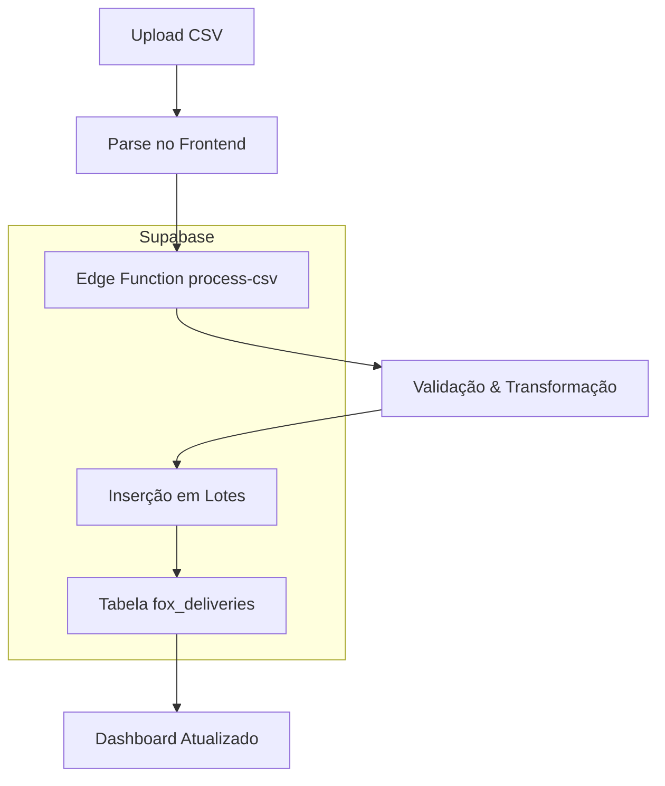

# 🚀 Sistema de Processamento CSV com Supabase

## Visão Geral

Este sistema moderniza o processamento de dados de entrega, movendo a lógica do frontend para o servidor usando Supabase Edge Functions. Isso proporciona:

- **📊 Melhor Performance**: Processamento server-side para arquivos grandes
- **🔒 Maior Escalabilidade**: Sem limitações de memória do browser
- **💾 Persistência**: Dados armazenados permanentemente no Supabase
- **🔄 Deduplicação**: Automática baseada em job_id
- **📈 Estatísticas**: Contagem precisa de drivers baseada em job_ids únicos

## Arquitetura



## Componentes Principais

### 1. Edge Function: `process-csv`
- **Localização**: `supabase/functions/process-csv/index.ts`
- **Função**: Processa dados CSV server-side
- **Features**:
  - Validação de dados
  - Transformação de schema
  - Inserção em lotes (100 registros por vez)
  - Deduplicação por job_id
  - Relatório de estatísticas

### 2. Serviço: `CSVProcessingService`
- **Localização**: `src/services/csvProcessingService.ts`
- **Função**: Interface entre frontend e Edge Function
- **Métodos**:
  - `parseCSVFile()`: Parse do arquivo CSV
  - `processCSVData()`: Envio para Edge Function
  - `uploadAndProcessCSV()`: Workflow completo
  - `getProcessingStats()`: Estatísticas do banco
  - `getDeliveryData()`: Busca dados processados
  - `getDriverMetrics()`: Métricas baseadas em job_ids únicos

### 3. Componente: `SupabaseCSVUpload`
- **Localização**: `src/components/csv-upload/SupabaseCSVUpload.tsx`
- **Função**: Interface de upload melhorada
- **Features**:
  - Drag & drop de arquivos
  - Progress bar durante processamento
  - Estatísticas em tempo real
  - Relatório de resultados
  - Instruções de formato

### 4. Hooks de Dados

#### `useSupabaseDeliveryData`
- Busca dados diretamente do Supabase
- Transforma dados para formato da aplicação
- Calcula métricas de drivers e clientes

#### `useHybridDeliveryData`
- Combina dados do Supabase e localStorage
- Preferência configurável por fonte
- Fallback automático entre fontes

## Como Usar

### 1. Upload de CSV via Interface

1. Acesse **Data Import > Supabase Upload**
2. Faça upload do arquivo CSV (máx 50MB)
3. Aguarde o processamento
4. Visualize estatísticas e resultados

### 2. Programaticamente

```typescript
import { CSVProcessingService } from '@/services/csvProcessingService';

// Upload e processamento completo
const result = await CSVProcessingService.uploadAndProcessCSV(file);

if (result.success) {
  console.log('Processamento concluído:', result.stats);
} else {
  console.error('Erro:', result.message);
}

// Buscar dados processados
const deliveries = await CSVProcessingService.getDeliveryData();

// Obter métricas de drivers
const metrics = await CSVProcessingService.getDriverMetrics();
console.log('Total de drivers ativos:', metrics.totalActiveDrivers);
```

### 3. Usando os Hooks

```typescript
import { useSupabaseDeliveryData } from '@/features/deliveries/hooks/useSupabaseDeliveryData';

function Component() {
  const { deliveryData, loading, stats, refetch } = useSupabaseDeliveryData();
  
  if (loading) return <div>Carregando...</div>;
  
  return (
    <div>
      <p>Total de entregas: {stats?.totalDeliveries}</p>
      <p>Drivers únicos: {stats?.uniqueJobIds}</p>
      {/* Renderizar dados */}
    </div>
  );
}
```

## Formato CSV Suportado

### Colunas Obrigatórias
- `job_id` ou `id` (identificador único)

### Colunas Opcionais
```csv
job_id,collecting_driver,delivering_driver,customer_name,pickup_address,delivery_address,status,created_at,cost,distance,service_type,company_name
```

### Mapeamento Automático
O sistema mapeia automaticamente variações de nomes de colunas:
- `pickup_driver` → `collecting_driver`
- `delivery_driver` → `delivering_driver`
- `client_name` → `customer_name`
- `from_address` → `pickup_address`
- `to_address` → `delivery_address`
- `price` → `cost`

## Contagem de Drivers

### ✅ Método Atual (Correto)
A contagem de "Total Drivers" é baseada em **job_ids únicos** da tabela `fox_deliveries`:

```sql
SELECT COUNT(DISTINCT job_id) FROM fox_deliveries WHERE job_id IS NOT NULL;
```

### Vantagens
- **Precisão**: Cada job_id representa um trabalho único
- **Consistência**: Mesma lógica em todas as páginas
- **Escalabilidade**: Funciona com qualquer volume de dados
- **Deduplicação**: Uploads repetidos não inflam a contagem

## Configuração

### Variáveis de Ambiente
Certifique-se de que estas variáveis estão configuradas:

```env
VITE_SUPABASE_URL=https://mqjzleuzlnzxkhkbmnhr.supabase.co
VITE_SUPABASE_ANON_KEY=seu_anon_key_aqui
```

### Edge Function
A função está deployada em:
- **Projeto**: Fox Delivery System (mqjzleuzlnzxkhkbmnhr)
- **Nome**: process-csv
- **Status**: ACTIVE

## Migração do Sistema Legado

### Opção 1: Migração Gradual
1. Use `useHybridDeliveryData` com `preferSupabase: true`
2. Upload dados existentes via nova interface
3. Remova dados do localStorage após confirmação

### Opção 2: Migração Completa
1. Substitua `useDeliveryData` por `useSupabaseDeliveryData`
2. Upload todos os CSVs via nova interface
3. Remova componentes legados

## Troubleshooting

### Erro: "Edge Function not found"
- Verifique se a função está deployada
- Confirme o nome da função (`process-csv`)

### Erro: "Invalid CSV data"
- Verifique se o arquivo tem cabeçalhos
- Confirme que existe coluna `job_id` ou `id`

### Contagem de drivers incorreta
- Execute: `await CSVProcessingService.getDriverMetrics()`
- Verifique logs no console para debug

### Performance lenta
- Reduza tamanho do CSV (< 10k linhas por arquivo)
- Use processamento em lotes

## Logs e Monitoramento

### Frontend
```typescript
// Ativar logs detalhados
console.log('🔄 Fetching delivery data from Supabase...');
console.log('📊 Loaded X deliveries from Supabase');
```

### Edge Function
Acesse os logs no Supabase Dashboard:
- **Project** → **Edge Functions** → **process-csv** → **Logs**

### Banco de Dados
```sql
-- Verificar últimos uploads
SELECT uploaded_at, uploaded_by, COUNT(*) 
FROM fox_deliveries 
GROUP BY uploaded_at, uploaded_by 
ORDER BY uploaded_at DESC;

-- Contagem por status
SELECT status, COUNT(*) 
FROM fox_deliveries 
GROUP BY status;
```

## Próximos Passos

1. **Geocoding**: Adicionar coordenadas automáticas
2. **Webhooks**: Notificações em tempo real
3. **Análise**: Dashboards avançados
4. **API**: Endpoints REST para integração
5. **Backup**: Exportação automática de dados

---

**Status**: ✅ Sistema implementado e funcional
**Última atualização**: Janeiro 2025 